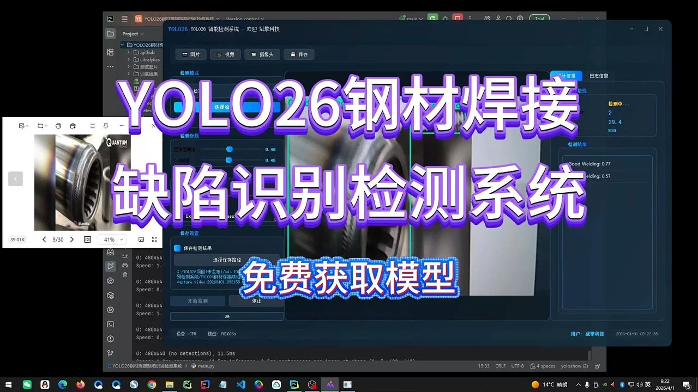
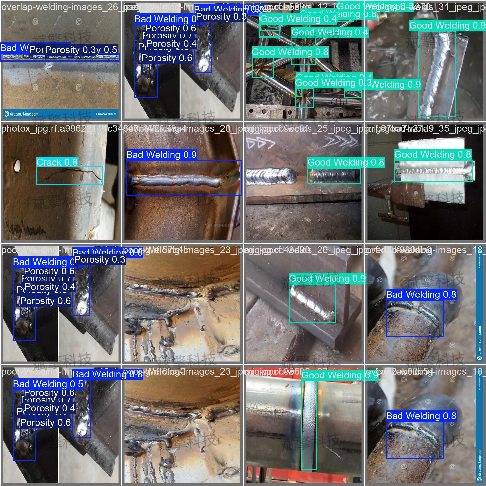
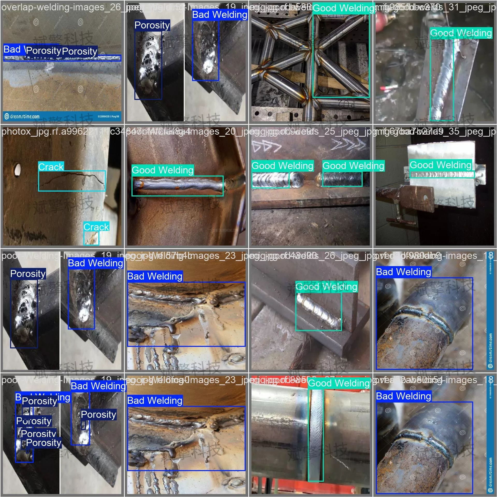
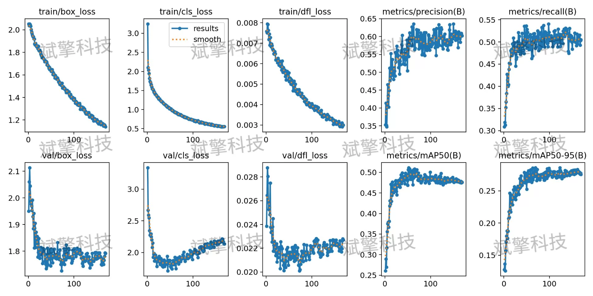
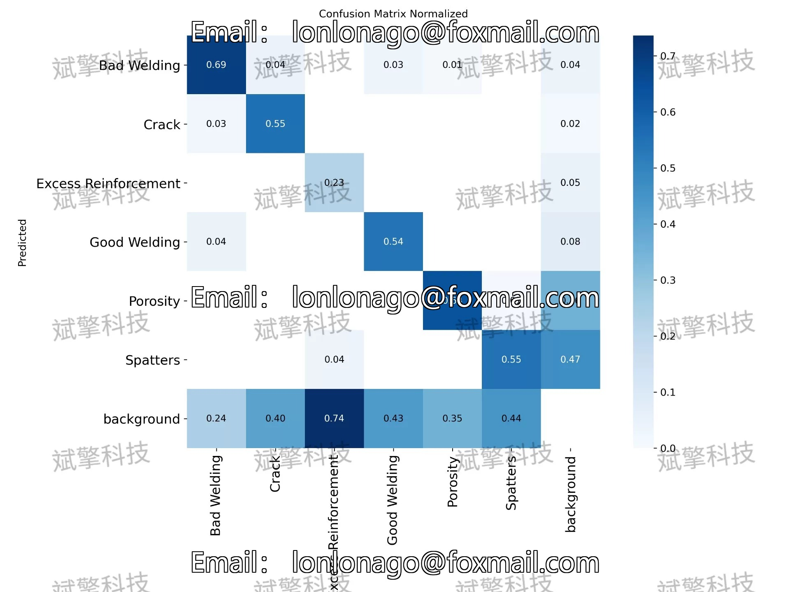
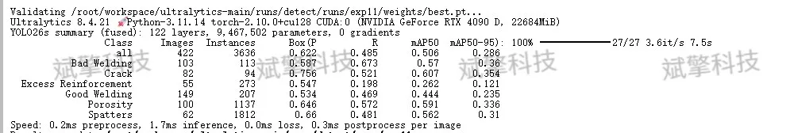
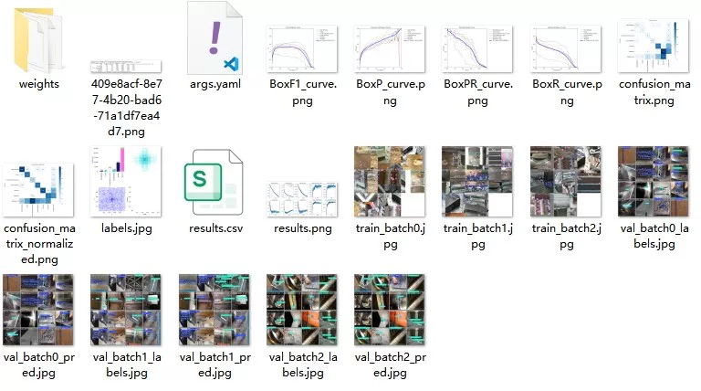
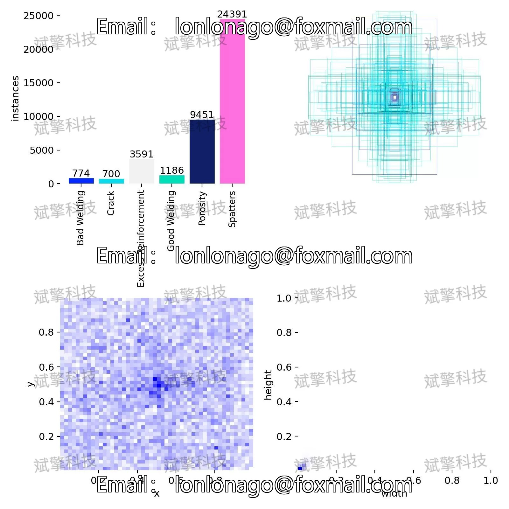

# YOLO26 Steel Welding Defect Detection System

## Body

YOLO26 Steel Welding Defect Detection System Based on YOLO26 Deep Learning (Project Source Code + Dataset + Model Weights + UI Interface + Python + Deep Learning + Remote Environment Deployment)

This study proposes a target detection system based on YOLO26 for the automated recognition and classification of steel welding defects. The system aims to solve the problems of low efficiency, subjectivity, and fatigue in traditional manual visual inspection. We have constructed a welding dataset containing six categories: "Bad Welding", "Crack", "Excess Reinforcement", "Good Welding", "Porosity", and "Spatters", and conducted comprehensive training and evaluation of the model.

The dataset contains 6 categories, covering common welding defects and normal welding joints, with specific category names as follows:
Bad Welding: Bad welding
Crack: Crack
Excess Reinforcement: Excess reinforcement
Good Welding: Good welding
Porosity: Porosity
background: Non-defect area
The dataset is divided into training sets, validation sets, and test sets to ensure the objectivity and generalization ability of the model evaluation.
Training set: 3037 images, used for learning model parameters.
Validation set: 422 images, used for adjusting hyperparameters during training and monitoring model performance (the results reported in the article come from this).
Test set: 205 images, used for independent evaluation of final model performance.

Free reservation for remote installation. Unsuccessful full refund.
Purchase Enjoy the following resources (Baidu Drive auto unlock)
   YOLO Identification Detection Project Complete Source Code
    YOLO format Dataset
     Training code + UI interface code
     Trained model + result image
     Software install package
     Add WeChat reservation for remote installation (Automatically display WeChat ID after purchase) - Unsuccessful full refund

⚙️ Core Function Modules
Detection Capability
    Image Detection: Upon upload, return detection boxes + category information
     Video Detection: Support video files, analyze frames accurately
    Camera Real-time Detection: Integrate USB camera, realize dynamic monitoring
Interaction and Control
    Target Filtering: Choose one or more categories for detection
    Parameter Real-time Adjustment: Adjustable confidence threshold & IoU threshold, flexibly control accuracy
    Result Save: One-click save of image/video/camera detection results
System and Data
    User login registration: Support password strength detection + Encrypted storage
    Log recording: Automate operation and error information (with timestamp)

## Images

## Payment

Here is a pay link on Stripe ( https://buy.stripe.com/3cs8yP7sY87d0vu9AB ). Please contact me lonlonago@foxmail.com after funding $89, and I will send you a complete data files , thank you!

